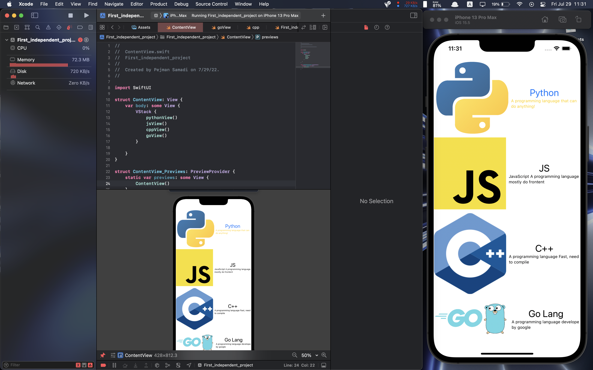
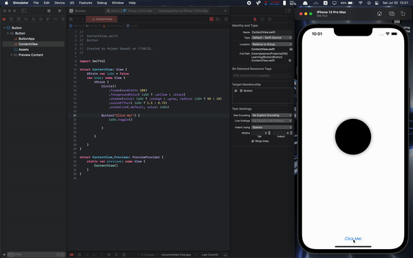

# Swift Documentation For Me

## Variables

### Var

```swift
var name = "Pejman"     // String
var age = 21            // Int

age = age + 1           // age = 22
age = 23                // age = 23 
age = "twenty-three"    // Error
```

### Const

```swift
let name = "Pejman"     // String
name = "Pezhman"      // Error (Constants values can't changed)
```
---
## Loops

Loop structures in swift

### For loop

```swift
for i in 1...5 {
	print(i)
}
/* --- output --- */
/* 1
 * 2
 * 3
 * 4
 * 5
 */
```

## While loop

```swift
while condition {
		// do something
}
```

## Datatype conversion

```swift
// Convert other datatypes to String
// var num = 23
// var isOn = false
Text("Method 1: \(String(isOn)). \(String(num))")    
Text("Method 2: \(isOn).. \(num)" as String)
Text(verbatim: "Method 3: \(isOn)... \(num)")
```
---
## Views

### My First App

```swift
import SwiftUI

struct pythonView: View {
    var body: some View {
        VStack {
            HStack {
                Image("python")     // in Assets Folder
                    .resizable()
                    .scaledToFit()
                VStack {
                    Text("Python")
                        .font(.title)
                        .foregroundColor(.blue)
                    Text("A programming language that can do anything!")
                        .font(.caption)
                        .foregroundColor(.yellow)
                }
            }
        }
    }
}

struct pythonView_Previews: PreviewProvider {
    static var previews: some View {
        pythonView()
    }
}
```

> Output



---

## Keep on with Apps

### Data Separation

- Always Define variables outside of View body

```swift
struct ConditionalViews: View {
		@State var isOn = false       // Correct
    var body: some View {
		@State var isOn = false   // Wrong
        VStack {
			...
		}
	}
}
```

### State Variables

In the Previous Example, there is a `@State` before defining a variable; if you want to change UI and View via Variables, this is how to do it.

> `@State` is a property wrapper
> 

---

### Ternary conditional operation

```swift
Circle()
	.foregroundColor( isOn ? .yellow : .black )
```

if isOn = true Circle is yellow else it’ll be black

- Example

```swift
Circle()
	.frame(maxHeight: 200)
    .foregroundColor( isOn ? .yellow : .black )
    .shadow(color: isOn ? .orange : .gray, radius: isOn ? 50 : 10 )   
```

- [Example](./Button/)

```swift
import SwiftUI

struct ConditionalCircle: View {
    @State var isOn = false
    
    var body: some View {
        VStack {
            Circle()
                .frame(maxHeight: 200)
                .foregroundColor( isOn ? .yellow : .black )
                .shadow(color: isOn ? .orange : .gray, radius: isOn ? 50 : 10 )
                .scaleEffect( isOn ? 1.5 : 0.75)
                .animation(.default, value: isOn)
            

            Button("Press Me") {
                isOn.toggle()
            }
        }
    }
}

struct SwiftUIView_Previews: PreviewProvider {
    static var previews: some View {
        ConditionalCircle().assess()
    }
}
```



---

## Binding

```swift
Toggle("Press Me", isOn: $isOn)     // bind a parameter to a variable
    .padding()

ColorPicker("Select a Color", selection: $color)
    .padding()                      // add space between views

Image(systemName: isOn ? "battery.100" : "battery.25")
    .font(.system(size: 150))
    .foregroundColor(color)

Text("This one also change")
    .font( isOn ? .largeTitle : .subheadline)
    .foregroundColor(color)
    .padding()

Spacer()                            // add space between views
```

---
