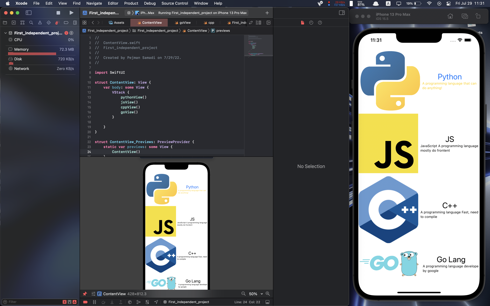
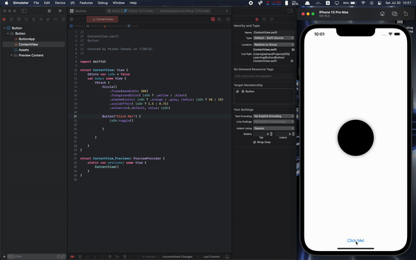

# Swift Documentation For Me

## Variables

* [Var](./resources/Variables/var.swift)
* [Const](./resources/Variables/const.swift)
---
## Loops

Loop structures in swift

* [For loop](./resources/loops/for.swift)
* [While loop](./resources/loops/while.swift)
---

## Datatype conversion

* [as String](./resources/datatype_conversion/tostring.swift)

---

## Views

#### My First App

* [Content](./resources/app/ContentView.swift)
> Output



---

## Keep on with Apps

### Data Separation

- Always Define variables outside of View body
- [data_separation](./resources/data_separation.swift)

### State Variables

In the Previous Example, there is a `@State` before defining a variable; if you want to change UI and View via Variables, this is how to do it.

> `@State` is a property wrapper

---

### Ternary conditional operation

```swift
Circle()
	.foregroundColor( isOn ? .yellow : .black )
```

if isOn = true Circle is yellow else it’ll be black

- Example

```swift
Circle()
	.frame(maxHeight: 200)
    .foregroundColor( isOn ? .yellow : .black )
    .shadow(color: isOn ? .orange : .gray, radius: isOn ? 50 : 10 )   
```

- [Example](./Button/)
- [ButtonView](./resources/Button_app/buttonView.swift)



---

## Binding

* [binding](./resources/binding.swift)

---

## NavigationView

* [NavigationView and NavigationLink](./resources/navigation/NavigationView.swift)

>check this [nav.gif](./assets/nav.gif) to learn about NavigationView and NavigationLinks
>>Important Note: `NavigationLink` **must** be inside `NavigationView`

---

## Functions & Classes
* [functions](./resources/functions/func.swift)

* [classes](./resources/classes/class.swift)